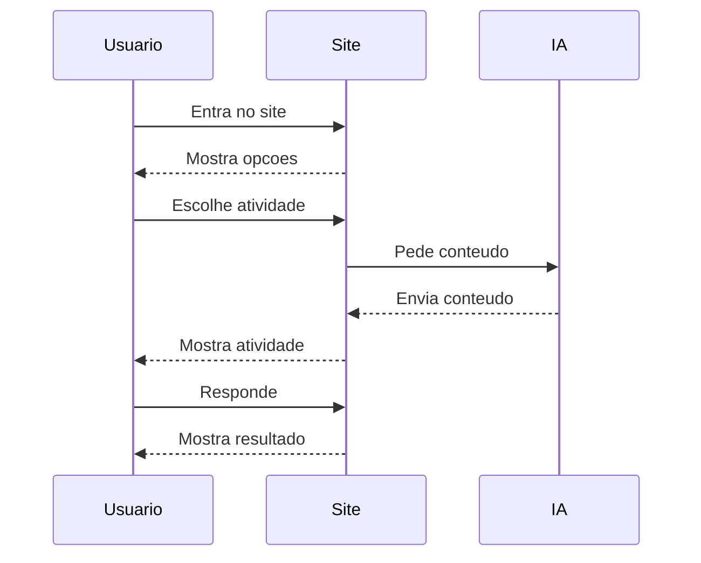

📚 **Projeto: Alfabetiza+**
Um site desenvolvido para ajudar pessoas analfabetas a aprenderem a ler e escrever de forma simples, interativa e acessível.

🎯 **Objetivo**
O Alfabetiza+ tem como objetivo facilitar o processo de alfabetização por meio de uma plataforma digital intuitiva, utilizando recursos visuais, áudio e atividades práticas do dia a dia.

👥 **Público-Alvo**
Pessoas analfabetas ou com dificuldade de leitura
Adultos em processo de alfabetização
Usuários que precisam de uma abordagem simples e acessível

🚀 **Funcionalidades**
🔊 Áudio explicativo em todas as etapas
🔤 Ensino de letras e palavras básicas
🧠 Exercícios interativos
📈 Acompanhamento de progresso
🎨 Interface simples e visual (sem necessidade de leitura)

🛠️ **Tecnologias Utilizadas**
HTML5
CSS3
JavaScript
(Opcional) API de Text-to-Speech (TTS)
(Opcional) Banco de dados (Firebase, MongoDB, etc.)

📱 **Acessibilidade**
O sistema foi pensado para ser acessível:
Uso de ícones grandes e intuitivos
Navegação simples
Áudios em todas as instruções
Pouco ou nenhum texto complexo

```mermaid
    flowchart TD
    Usuario((Usuario))

    UC1[Estudar leitura]
    UC2[Ouvir explicacao]
    UC3[Responder atividade]
    UC4[Ver resultado]

    Usuario --> UC1
    Usuario --> UC2
    Usuario --> UC3
    Usuario --> UC4
 ```
```mermaid
stateDiagram-v2
    [*] --> Inicio

    Inicio --> Menu
    Menu --> Atividade
    Atividade --> Resultado
    Resultado --> Menu

    Menu --> [*]
```
